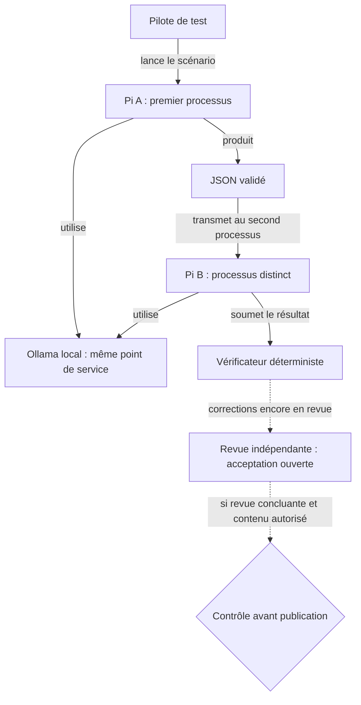
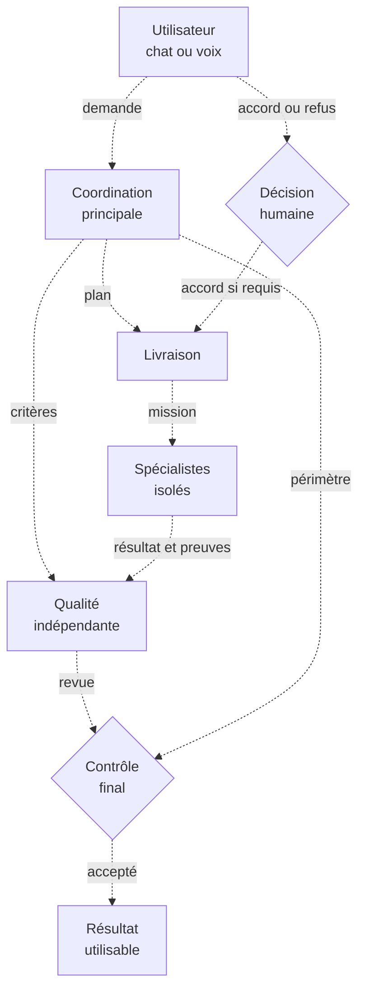
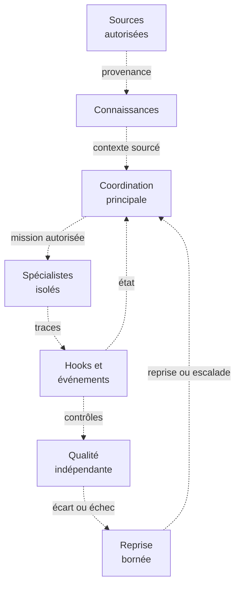

# Carte des connexions d’orchestration

Deux périmètres **UML-like**, datés du 1er octobre 2026 : un chemin historique limité et une organisation cible, cette dernière présentée en deux petits diagrammes. Le format Mermaid est destiné au rendu natif de GitHub ; les équivalents textuels restent lisibles sans moteur de diagrammes. Aucun service, dépendance ou interface supplémentaire n’est créé.

## Légende et limites

- **Flèche continue** : relation du test historique rapporté, dans ce seul périmètre
- **Flèche pointillée** : suite conditionnelle ou relation proposée, jamais une connexion déclarée déployée
- **Rectangle** : rôle, processus ou donnée ; **losange** : décision ou contrôle préalable
- **Nœud « Spécialistes »** : regroupement de rôles, sans garantie technique d’isolation
- Les libellés et les styles de traits portent le sens ; aucune couleur n’est nécessaire

Cette carte n’est ni un inventaire exhaustif d’installation ni une télémétrie en direct. Une preuve historique ne démontre pas la disponibilité actuelle. Les états inconnus restent inconnus.

## 1. Chemin historique limité

La synthèse historique rapporte deux processus Pi distincts, utilisant **le même point de service Ollama local**, avec transmission d’un JSON validé. Elle ne démontre ni deux machines, ni deux serveurs de modèles, ni un sandbox système d’exploitation. La validation du JSON ne garantit pas la justesse de son contenu.

**Équivalent textuel**

1. Le pilote de test lance Pi A, qui utilise Ollama local
2. Pi A produit le JSON validé transmis à Pi B
3. Pi B est un processus séparé et utilise le même point de service Ollama
4. Le résultat passe par un vérificateur déterministe
5. Les corrections du vérificateur restent en revue indépendante ; leur acceptation n’est pas acquise
6. Le contrôle avant publication reste conditionnel : revue concluante, périmètre vérifié et contenu autorisé

Cette synthèse ne joint pas les traces du test et ne vaut pas acceptation publique du scénario complet. La publication d’une documentation ne valide pas son runtime. Aucun nouveau test ni contrôle de disponibilité actuelle n’est revendiqué ici.

## 2. Organisation cible proposée

**Toutes les connexions ci-dessous sont proposées et pointillées. Aucun déploiement n’est revendiqué.** Les vues représentent des fonctions, pas une sélection de produits, de transports ou un nombre imposé d’agents. Un nœud « Spécialistes » regroupe les seuls rôles nécessaires : recherche, développement, connaissances, interface, vision et voix, chacun dans son environnement dédié.

### 2.1. Responsabilités et livraison

Huit nœuds résument la hiérarchie et ses contrôles. Lorsqu’un accord humain est requis, l’action concernée reste suspendue jusqu’à sa réception ; ce contrôle s’applique avant l’action, pas seulement à la livraison finale.

### 2.2. Contexte, événements et reprise

Sept nœuds montrent la boucle de contrôle. Les rôles répétés désignent les mêmes fonctions que dans la vue précédente, sans ajouter de nouveaux agents. Les états périmés ou inconnus et les limites de reprise restent explicites.

**Équivalent textuel des connexions**

- Chat ou voix → coordination principale : intention, contraintes et résultat attendu
- Coordination → livraison : plan et dépendances ; coordination → qualité : critères de contrôle indépendant
- Coordination ↔ décision humaine : demander l’accord lorsque requis, conserver la réponse et suspendre l’action dépendante tant que l’accord manque
- Livraison ↔ spécialistes : missions, résultats, erreurs et demandes d’aide dans des canaux explicites ; le nœud regroupé représente chaque rôle mobilisé
- Sources autorisées → connaissances → coordination : références, versions, fraîcheur, couverture et lacunes
- Spécialistes → hooks/événements → coordination et qualité : progression observable, erreurs et contrôles réellement effectués
- Livraison → qualité → livraison : livrable et preuves, puis écarts et corrections ciblées ; la livraison ne s’auto-attribue pas l’acceptation indépendante
- Livraison → reprise bornée → coordination : reprendre depuis un état connu ou escalader, sans boucle indéfinie ni double écriture
- Qualité et coordination → contrôle final → résultat utilisateur : revue concluante et autorisations adaptées à la livraison ou à la publication

### Contrats communs proposés

- **Communication** : identifiant de tâche, état, entrées/sorties, références et erreurs exploitables ; une demande d’aide n’accorde pas de droit d’écriture supplémentaire
- **Isolation** : dossiers, runtimes, permissions et responsabilités distincts ; un propriétaire par ressource écrite. Les réparations croisées exigent un accord de périmètre
- **Reprises** : fixer avant exécution un plafond d’essais et des conditions d’arrêt ; à épuisement, refus d’accès ou résultat indéterminé, signaler le blocage. Aucun seuil numérique n’a encore été choisi
- **Qualité** : absence de vérificateur, preuve périmée ou test non effectué ne vaut jamais réussite ; une correction repasse par contrôle et revue
- **Autorisation** : un événement ou message d’agent ne remplace pas l’approbation humaine requise ; secrets et données privées restent hors de la publication

## Traçabilité et contrôle du document

La vue cible traduit les [exigences](requirements.md), notamment l’architecture (§3), les connaissances (R06/R13), les nœuds isolés (R09), les événements et reprises (R10), la carte vérifiable (R15), la voix (R17/R18) et la confidentialité (R20). Le [registre des tâches](tasks.json) reste la référence de planification ; cette carte n’en modifie aucun statut.

Après publication sur la branche, vérifier le rendu Mermaid natif, les libellés, les liens relatifs et la lisibilité en niveaux de gris avant de déclarer le document validé. Les équivalents textuels servent de repli accessible. Actualiser la vue historique uniquement à partir d’une preuve délimitée ; conserver toute connexion cible en pointillé tant que son intégration n’est pas établie.
